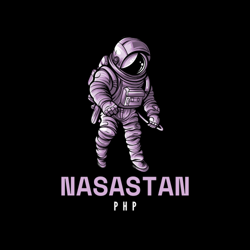

<div align="center" style="padding-top: 2rem;">
    
    <div style="display: inline-block; padding-top: 4rem">
        
        
        
        
    </div>
</div>

# Nasastan 🚀

A PHPStan extension that enforces
NASA's [Power of Ten](https://en.wikipedia.org/wiki/The_Power_of_10:_Rules_for_Developing_Safety-Critical_Code)
rule in your PHP code.

> ⚠️ This is solely a package for self-learning. You're on your own if you use this package for the time being.

## Why should I use this extension?

Great question. I'm still trying to figure out an answer to that myself.

## Installation

To get started, install the package with composer:

```
composer require --dev joeymckenzie/nasastan
```

## Usage

If you're using `phpstan/extension-installer`, you're all set!

If not, however, include the extension in your PHPStan configuration:

```yaml
includes:
  - vendor/joeymckenzie/nasastan/extension.neon
```

## Original NASA Power of Ten Rules

1. No complex flow constructs (no goto, setjmp, longjmp, recursion)
2. All loops must have fixed bounds
3. No dynamic memory allocation after initialization
4. No function should be larger than 60 lines
5. The assertion density should be at least 2%
6. Objects must have at least two assertions
7. Data objects must be declared at smallest possible level
8. The return value of non-void functions must be checked
9. Preprocessor use must be limited to file inclusion and simple macros
10. All code must be compiled, from day one, with all compiler warnings enabled

## PHP Adaptation

Some rules are adapted to make sense in PHP:

- Rule #9 (Preprocessor use) is not applicable to PHP and is implemented as strict typing requirements
- Rule #3 (Memory allocation) checks for object instantiation outside configurable initialization methods
- Rule #5 and #6 (Assertions) count PHP type declarations and if conditions as assertions
- All threshold values are configurable to match your personal preferences

## References

- [The Power of Ten – Rules for Developing Safety Critical Code](https://en.wikipedia.org/wiki/The_Power_of_10:_Rules_for_Developing_Safety-Critical_Code)
- [Original NASA JPL article by Gerard J. Holzmann](https://spinroot.com/gerard/pdf/P10.pdf)